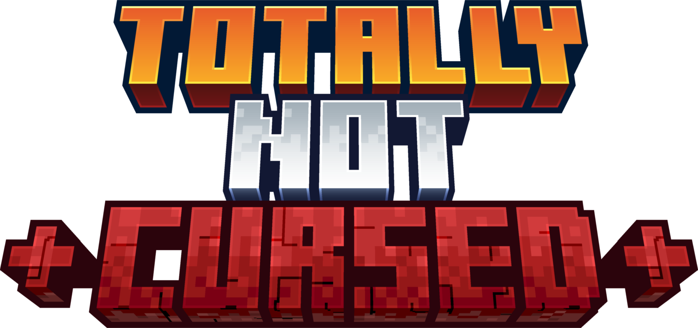

<p align="center">
  
</p>

# Totally Not Cursed - The Ultimate Horror Survival Experience

> [!WARNING]
> This modpack is still in active development and has not yet reached a stable release. Expect bugs, incomplete features, and potential world corruption. Always back up your worlds before playing!

🎮 Welcome to a Minecraft experience that will fundamentally change how you perceive survival. This isn't just another horror modpack with jump scares—it's a revolutionary genre-blending experience that fuses psychological horror, tactical FPS mechanics, and survival gameplay into something entirely unprecedented in the Minecraft ecosystem.

## 🧠 Psychological Horror & Sanity Management

Your mind becomes your most vulnerable resource. The Sanity system introduces a mental health scale that, when neglected, leads to drastic consequences including fatal outcomes. As your sanity deteriorates, reality begins to blur—phantom sounds echo through caves, shadows move when they shouldn't, and the line between what's real and what's madness becomes impossibly thin. Every decision affects your mental state, from the food you eat to the company you keep.

## 👹 Intelligent Stalking Entities

Stalking entities like The Man From The Fog actively hunt you with complex behaviors—climbing structures, breaking blocks, and ambushing players at unexpected moments. These aren't simple monsters; they're persistent predators that adapt to your strategies. The Cave Dweller lurks in underground tunnels, while Eyes in the Darkness watch from the shadows. Each creature has its own hunting patterns, forcing you to constantly adapt your survival tactics.

## 🎯 Tactical FPS Combat System

This isn't casual gunplay—it's hardcore tactical combat borrowed from modern FPS games. Like in Escape from Tarkov, you must manually inspect your weapons to check ammunition levels; there's no HUD counter to hold your hand. The advanced ping system lets you mark locations and communicate tactical information, turning multiplayer sessions into coordinated military operations. Every shot matters, every reload could be your last, and proper weapon maintenance becomes a life-or-death skill.

## 🌫️ Atmospheric World Generation

The world itself becomes your enemy. Amplified terrain generation creates imposing landscapes, while mods like The Graveyard and Deep Dark: Regrowth populate the world with ominous structures and corrupted biomes. Enhanced audio design with Sound Physics and AmbientSounds creates an oppressive atmosphere where every footstep, every distant sound, could signal approaching danger.

## ⚡ The Perfect Storm of Horror

What makes Totally Not Cursed unique is how these genre-blending systems interact. Your deteriorating sanity affects your perception of tactical situations. Stalking entities exploit moments when you're mentally vulnerable. The hardcore FPS mechanics demand precision when supernatural threats close in. This isn't just horror, FPS, or survival—it's a complete fusion of genres that creates something entirely new in the Minecraft landscape.

⚠️ **Warning**: This modpack is designed for players who want their survival experience to be genuinely challenging and psychologically intense. It's not for casual play—it's for those who want to test their limits in a world where nothing is safe, nothing is certain, and survival depends on both your tactical skills and mental fortitude.

## 🚀 Installation

Our modpack is crafted in the **[packwiz](https://github.com/packwiz)** format for seamless mod management.

📖 **[Complete Installation Guide](./INSTALLATION.md)** - Detailed instructions for all launchers including system requirements and troubleshooting.

## ✨ Known Issues & 🛠️ TODOs

For the latest Known Issues and TODOs, check out the [Projects](https://github.com/orgs/TotallyNotCursed/projects) tab.

## 📜 Licensing

This modpack is **All Rights Reserved**. Third-party content included in the modpack retains its original license. Please refer to the respective authors' licenses for usage terms.

### Why All Rights Reserved?

- 🛡️ **Unified Development**: Forks should be created solely for the purpose of submitting enhancements or fixes to the original repository via pull requests. This approach ensures the modpack's development remains cohesive and focused.
- 🚫 **Prohibited Redistribution**: Redistribution of builds or hosting the modpack elsewhere is strictly forbidden. This guarantees users always access the official and authentic version.

### Future Relicensing

This modpack and all its contributions may be relicensed under fully open licenses in the future, either if the modpack is abandoned or if we decide to switch to open source.

- **Code:** may transition to [GPLv3](https://www.gnu.org/licenses/gpl-3.0.txt)
- **Media assets:** may transition to [CC BY-SA 4.0](https://creativecommons.org/licenses/by-sa/4.0/legalcode.txt)

Such relicensing will have **retroactive effect**—all past, present, and future revisions will be covered. By contributing, you acknowledge and accept that your contributions (regardless of when made) may be included in this relicensing, and no further consent will be needed.

### Exceptions for Content Creators

Content creators are free to use the modpack logo for their video thumbnails or other promotional materials and must provide proper attribution when creating content about the modpack. An example of acceptable attribution is:

```
"Totally Not Cursed" modpack by the Totally Not Cursed team and contributors.
```

## 🧑‍💻 Credits for Mods, Resource Packs, Shaderpacks, and Other Content

Below is a list of all mods, resource packs, shaderpacks, and additional content included in Totally Not Cursed, organized by category. We extend our gratitude to the developers for their contributions.

### Note for Developers

If you are a developer whose content is included in this modpack and would like it removed, please open an issue. We will promptly address your request.

The information listed below for mods is taken directly from the mod metadata. If you notice any inaccuracies, please report them to the respective mod author. If you are the mod author, kindly update the metadata to ensure correctness.
For resource packs, shaderpacks, and other content without metadata, please report any inaccuracies directly to us.

### Mods

- "3d-Skin-Layers" by tr7zw
- "Additional Structures" by XxRexRaptorxX (RexRaptor)
- "Advancement Plaques" by Grend
- "Almanac" by frikinjay
- "AmbientSounds" by CreativeMD
- "Amplified Nether" by Stardust Labs
- "Amplified Nether Height" by fliplus
- "Another Furniture" by Starfish Studios
- "AppleSkin" by squeek
- "Architectury" by shedaniel
- "Arthropod Phobia Expansions" by Vllax
- "BE Style Wither" by MORIMORI0317
- "BadOptimizations" by Thosea
- "Beautiful Enchanted Books" by CerbonXD
- "Better Advancements" by way2muchnoise
- "Better Compatibility Checker" by Gaz
- "Better Ping Display" by Quintinity
- "Better Statistics Screen" by TheCSDev
- "Biomes O' Plenty" by Adubbz, Forstride
- "Blur (Forge)" by dima_dencep, tterrag1098, Motschen, Pyrofab, backryun, byquanton
- "Boiled One Reimagined" by Hqrvester
- "Born in Chaos " by Mongoose_artist, MCreator
- "Box of Horrors" by Kuro Modding
- "Camera Overhaul" by Mirsario, Forge Port: CorgiTaco, ConfusingFool93 (AvacadoWizard120)
- "Chamber Clarity" by TKG112
- "Chat Heads" by dzwdz, Fourmisain
- "Cloth Config v10 API" by shedaniel
- "Clumps" by Jaredlll08
- "Collective" by Rick South
- "Configured" by MrCrayfish
- "Connector Extras" by Su5eD
- "Connector-1.0.0-beta.46+1.20.1" by
- "Continuity" by PepperCode1
- "Controlling" by Jaredlll08
- "CoroUtil" by Corosus
- "Crash Assistant" by KostromDan
- "CraterLib" by HypherionSA, Zenith
- "CravenCraft's Bloody Bits" by CravenCraft
- "CreativeCore" by CreativeMD
- "Cull Less Leaves Reforged" by CCr4ft3r (this port), isXander (original fabric version)
- "Cupboard utilities" by Someaddon
- "Deep Dark: Regrowth" by Clorofite, MCreator
- "Deltabox Lib" by DanBrown\_
- "Double Doors" by Rick South
- "Drippy Loading Screen" by Keksuccino
- "Dynamic FPS" by juliand665 & LostLuma
- "Dynamic Trees" by Ferreusveritas
- "Dynamic Trees for Biomes o' Plenty" by mangoose, Max Hyper
- "Dynamic Trees for The Twilight Forest" by Max Hyper
- "Embeddium" by embeddedt
- "EnhancedVisuals" by CreativeMD, Sonicjumper
- "Entity Model Features" by Traben
- "Entity Texture Features" by Traben
- "EntityCulling" by tr7zw
- "Exline's Copper Equipment" by Exline
- "Explorer's Compass" by ChaosTheDude
- "Explosive Enhancement" by Xylonity
- "ExtraSoundsNext" by Arbor, stashymane
- "Eyes in the Darkness" by gigaherz
- "FancyMenu" by Keksuccino
- "Fast IP Ping" by Fallen_Breath
- "FastQuit" by KingContaria, Kaleb Langley
- "Fastload-Reforged" by AbdElAziz
- "Ferrite Core" by malte0811
- "Footprint Particles" by Galeboy
- "Forgified Fabric API" by FabricMC, Sinytra
- "From The Fog" by Bret06
- "Fzzy Config" by fzzyhmstrs
- "Game Menu Remove GFARB" by MORIMORI0317
- "GeckoLib 4" by Gecko, Eliot, AzureDoom, DerToaster, Tslat, Witixin
- "Geophilic" by bebebea_loste
- "GlitchCore" by Adubbz
- "Gravestone Mod" by Max Henkel
- "Horror Element Mod" by Predator97427fr
- "Iceberg" by Grend
- "ImmersiveUI" by OctoStudios
- "In Your World" by EBALIA
- "Item Borders" by Grend
- "ItemPhysicLite" by CreativeMD
- "Jade" by Snownee
- "JeremySeq's Damage Indicator" by JeremySeq
- "John Mod Reborn" by Aerilon Legacy, & Others
- "Just Zoom" by Keksuccino
- "KeyPreset" by Memory_Yzf
- "Konkrete" by Keksuccino
- "Krypton Reforged" by
- "KubeJS" by LatvianModder
- "KuroLib" by Kuro Modding
- "LAN World Plug-n-Play" by Satxm
- "Let Me Despawn" by frikinjay
- "LibX" by ModdingX
- "Lunar" by Mrbysco
- "Macaw's Bridges" by Sketch Macaw & Peachy Macaw
- "Macaw's Doors" by Sketch Macaw & Sketch Peachy
- "Melody" by Keksuccino
- "Memory Leak Fix" by FX - PR0CESS
- "Model Gap Fix" by MehVahdJukaar
- "ModernFix" by embeddedt
- "Mouse Tweaks" by Ivan Molodetskikh (YaLTeR)
- "Nature's Compass" by ChaosTheDude
- "No Chat Reports" by Aizistral
- "Noisium" by Steveplays28
- "Not Enough Crashes" by Fudge
- "Not Enough Recipe Book" by OctoStudios
- "NotEnoughAnimations" by tr7zw
- "Nyctophobia" by Finallion
- "Nyf's Spiders" by Nyfaria
- "OctoLib" by OctoStudios
- "Oculus" by NanoLive, dima_dencep, coderbot, IMS212, Justsnoopy30, FoundationGames
- "Omega Mute" by Rick South
- "PacketFixer" by TonimatasDEV
- "Pale Garden Backport" by DanBrown\_
- "Particle Core" by fzzyhmstrs
- "Particular" by
- "Ping Wheel" by Luken, RXJpaw
- "Placebo" by Shadows_of_Fire
- "Player Animator" by KosmX
- "Presence Footsteps (Forge)" by Hurricaaane, Sollace, Paint_Ninja
- "Prism" by Grend
- "Radium" by dima_dencep, NanoLive
- "Realm RPG: Fallen Adventurers" by NoCube
- "Resourcefulconfig" by
- "Rhino" by latvian.dev, Mozilla
- "Roughly Enough Items (REI)" by shedaniel
- "Sanity: Descent Into Madness" by croissantnova
- "Satisfying Buttons" by Toni
- "Screenshot to Clipboard" by comp500
- "Searchables" by Jaredlll08
- "Simple RPC" by HypherionMC
- "SkinRestorer" by Lionarius
- "Sodium Dynamic Lights" by toni, LambdAurora
- "Sodium Extras" by toni
- "Sodium Options API" by toni
- "Sodium Options Mod Compat" by Toni, DeeChael
- "Sound Physics Remastered" by Sonic Ether, vlad2305m, Max Henkel, Saint
- "Structure Layout Optimizer" by TelepathicGrunt
- "TCD Commons API" by TheCSDev
- "TerraBlender" by Adubbz
- "The End of Herobrine" by lgow
- "The Graveyard" by Lion
- "The Knocker" by Ma_Do
- "The Man From The Fog" by M Productions
- "The Root of Fear" by Alexander's Fun and Games
- "The Starved Stalker" by shado, MCreator
- "The Twilight Forest" by Benimatic, AtomicBlom, Drullkus, Killer_Demon, quadraxis, Tamaized, williewillus, Andromander, GizmoTheMoonPig, jodlodi
- "This Rocks! (Forge)" by Motschen, TeamMidnightDust
- "Timeless & Classics Guns: Zero" by Serene Wave Studio | Timeless Squad
- "Tiny Item Animations" by Trivaxy
- "Toast Control" by Shadows_of_Fire
- "Totally Not Cursed Extras" by The Totally Not Cursed team and contributors
- "Travel Anchors" by CastCrafter
- "Traveler's Backpack" by Tiviacz1337
- "Traveler's Titles" by YUNGNICKYOUNG
- "Visuality: Reforged" by LimonBlaze
- "WF's Cave Overhaul" by W.F.
- "WaveyCapes" by tr7zw
- "What Are They Up To" by Corosus
- "Who's There ?" by Mortius, MCreator
- "Xaero's Minimap" by xaero96
- "Xaero's World Map" by xaero96
- "YUNG's API" by YUNGNICKYOUNG
- "You Died" by Gory_Moon
- "betterfpsdist mod" by Someaddon
- "cave_dweller" by Cadentem
- "chunksending mod" by Someaddon
- "e4mc" by skyevg
- "kotlinforforge-4.11.0-all" by
- "spark" by Luck
- "themimic_er" by Maximilian Cadentem

### Resource Packs

- "3D Ladders" by Nico4play
- "Default Dark Mode" by nebulr
- "Default Dark Mode: Expansion" by aric3435
- "Fresh Animations" by FreshLX
- "Small Caps Font" by ItsCreamMonster
- "Stay True" by haimcyfly
- "Visual Traveler's Titles" by unroman

### Shaderpacks

- "Bloody Shaders" by trece313
- "BSL Shaders" by CaptTatsu
- "Complementary Shaders - Reimagined" by EminGT
- "Hysteria Shaders" by ElocinDev
- "Miniature Shader" by ukrech
- "Rudimentary" by Recko
- "Spooklementary" by SpacEagle17

### Assets

**Wumpus Pixel Art**  
[](https://www.reddit.com/r/discordapp/comments/krerqe/v3_of_my_wumpus_pixel_art_ideas_and_suggestions/)  
Created by [KyleCraftMCYT](https://www.reddit.com/user/KyleCraftMCYT/)  
[View original Reddit post](https://www.reddit.com/r/discordapp/comments/krerqe/v3_of_my_wumpus_pixel_art_ideas_and_suggestions/)
